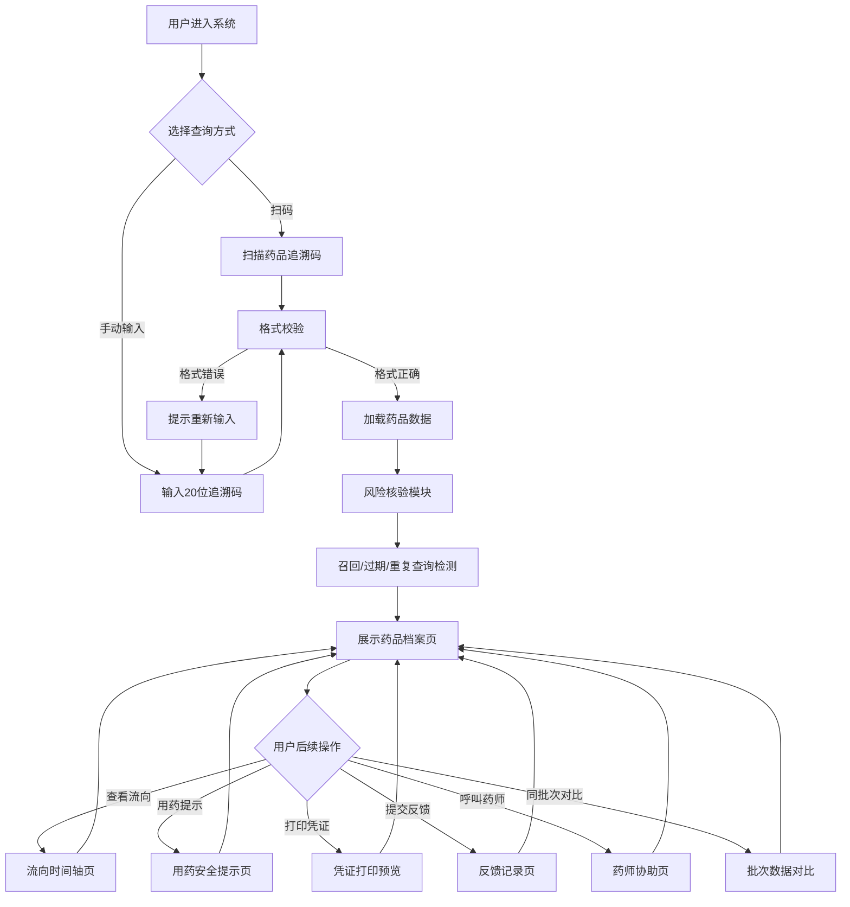

## 1. 产品概述

药品追溯自助查询系统是一款面向消费者的纯前端Web应用，部署于药店触屏终端和企业官网，提供药品全链条追溯信息核验服务。

- 核心目的：保障消费者用药安全，提供药品从生产到流通的全链路透明查询
- 目标用户：药店购药消费者、企业官网访客、药品监管相关人员
- 市场价值：提升药企品牌公信力，增强消费者用药信心，助力监管追溯体系建设

## 2. 核心功能

### 2.1 用户角色

| 角色 | 使用方式 | 核心权限 |
|------|----------|----------|
| 消费者 | 自助触屏/官网访问 | 扫码/输入追溯码、查询药品档案、查看流向、提交反馈 |
| 药师 | 触屏终端协助 | 呼叫服务、协助查询、专业解答 |

### 2.2 功能模块

1. **扫码首页**：品牌展示区、扫码入口、手动查询入口、药师协助快速入口
2. **手动查询**：追溯码输入框、历史查询记录、校验规则提示
3. **药品档案**：品名、规格、批号、生产日期、有效期、生产企业、检验结论、药品图片
4. **流向时间轴**：生产→检验→出库→批发→零售等全流通节点可视化
5. **风险核验**：召回状态、过期预警、重复查询提示、真伪验证
6. **用药提示**：适应症、用法用量、禁忌、不良反应、注意事项
7. **反馈记录**：问题分类、内容填写、联系方式、提交状态、查询历史
8. **药师协助**：药师呼叫、在线咨询、服务时间说明

### 2.3 页面详情

| 页面名称 | 模块名称 | 功能描述 |
|----------|----------|----------|
| 扫码首页 | 品牌头部 | Logo展示、系统名称、当前时间、语言切换 |
| 扫码首页 | 扫码引导区 | 大尺寸扫码图标、扫码动画、扫码框视觉引导 |
| 扫码首页 | 快捷操作区 | 手动查询按钮、常见问题入口、隐私说明入口 |
| 扫码首页 | 药师协助入口 | 悬浮药师卡片、一键呼叫、服务状态指示 |
| 手动查询 | 追溯码输入 | 20位追溯码输入、格式校验、输入提示 |
| 手动查询 | 历史查询 | 最近5条查询记录、一键复用、清除记录 |
| 手动查询 | 查询提交 | 查询按钮、加载动画、错误提示 |
| 药品档案 | 基本信息卡 | 品名/规格/批号等核心信息网格展示 |
| 药品档案 | 生产信息 | 生产企业、批准文号、GMP证书号 |
| 药品档案 | 质量信息 | 检验报告书编号、检验结论、检验日期 |
| 药品档案 | 状态标识 | 正品/召回/过期等状态徽章 |
| 流向时间轴 | 时间轴组件 | 纵向时间轴、节点图标、时间戳、操作人、地点 |
| 流向时间轴 | 节点详情 | 点击节点展开详情：运输方式、温度记录、签收人 |
| 流向时间轴 | 批次对比 | 同批次其他药品流向数据对比视图 |
| 风险核验 | 风险概览 | 红绿黄三色风险仪表盘 |
| 风险核验 | 异常告警 | 召回通知（红色醒目）、过期提醒（橙色）、重复查询（灰色提示） |
| 风险核验 | 真伪验证 | 电子监管码验证结果、防伪标识说明 |
| 用药提示 | 基础用药 | 适应症、用法用量表格化展示 |
| 用药提示 | 安全警示 | 禁忌人群、严重不良反应红色警示框 |
| 用药提示 | 注意事项 | 孕妇/哺乳期/老人/儿童用药说明 |
| 用药提示 | 药物相互作用 | 常见配伍禁忌列表 |
| 反馈记录 | 反馈表单 | 问题类型下拉、描述文本框、图片上传（模拟）、联系方式 |
| 反馈记录 | 历史记录 | 查询时间、追溯码、药品名、反馈状态标签 |
| 反馈记录 | 常见问题 | FAQ折叠面板、搜索功能 |
| 药师协助 | 药师信息卡 | 头像、姓名、执业证号、专业领域、评分 |
| 药师协助 | 呼叫界面 | 呼叫按钮、通话计时、挂断、文字消息输入 |
| 药师协助 | 离线提示 | 非服务时间提示、留言功能 |
| 查询凭证 | 打印预览 | A4样式凭证预览、二维码、查询章 |
| 查询凭证 | 打印功能 | 浏览器打印API调用、样式适配 |
| 隐私说明 | 政策文本 | 数据收集说明、使用范围、保护措施、用户权利 |

## 3. 核心流程

### 3.1 主要查询流程

消费者进入系统 → 扫码识别或手动输入追溯码 → 系统校验追溯码格式 → 查询药品档案与流向数据 → 风险核验（召回/过期/重复查询检测） → 展示药品档案+流向时间轴+风险状态 → 用户可查看用药提示/打印凭证/提交反馈/呼叫药师

### 3.2 流程图

## 4. 用户界面设计

### 4.1 设计风格

- **主色调**：医疗蓝 `#0EA5E9` 为主色，代表专业与信赖；深青色 `#0F766E` 为辅助色，体现安全健康
- **警示色**：召回红 `#DC2626`、过期橙 `#F97316`、安全绿 `#10B981`
- **按钮风格**：大尺寸圆角（12-16px）、触控友好（min-height 56px）、渐变填充+微阴影
- **字体选择**：标题使用 Noto Serif SC（衬线、权威感），正文使用 Noto Sans SC（无衬线、可读性强）
- **字号层级**：标题 32-48px，副标题 20-24px，正文 16-18px，辅助文字 14px
- **布局风格**：卡片式布局、大留白、圆角卡片（20px）、柔和投影、玻璃拟态效果
- **图标风格**：线性图标（Lucide），24px为主，状态徽章使用填充式图标
- **整体基调**：专业医疗感、安全可信赖、简洁易操作、适配触屏大字体

### 4.2 页面设计概览

| 页面名称 | 模块名称 | UI元素 |
|----------|----------|----------|
| 扫码首页 | 品牌头部 | 渐变背景、大Logo、医疗装饰元素、时间显示 |
| 扫码首页 | 扫码引导 | 脉冲动画扫码框、上下扫描线动画、四角定位标 |
| 扫码首页 | 快捷操作 | 大尺寸图标卡片、悬浮阴影动效、渐入动画 |
| 药品档案 | 状态横幅 | 全屏宽度状态条、风险等级颜色、状态图标+文字 |
| 药品档案 | 信息网格 | 2列网格布局、标签+值对、关键信息高亮 |
| 流向时间轴 | 时间轴 | 左侧彩色竖线、节点圆点、连线动画、交替卡片 |
| 风险核验 | 风险面板 | 三色仪表盘、进度条动画、告警列表 |
| 用药提示 | 警示卡片 | 红色边框警示、感叹号图标、折叠展开交互 |
| 反馈记录 | 表单 | 分段控件、大输入框、星级评分组件 |
| 药师协助 | 呼叫界面 | 圆形呼叫按钮、脉冲动画、通话状态卡片 |
| 打印凭证 | 凭证页 | A4白底、边框装饰、二维码区域、电子签章 |

### 4.3 响应式设计

- **设计优先**：Desktop-first，主断点 1920px（触屏机）→ 1366px → 1024px（平板）
- **触屏优化**：所有可点击元素 min-height: 56px，min-width: 56px，间距 ≥ 12px
- **字号自适应**：触屏机使用更大字号（+2px），确保老年人可读
- **触控反馈**：按下态 scale(0.98) + 高亮背景，提供即时操作反馈
- **键盘支持**：手动查询页支持Tab键切换、Enter提交

### 4.4 动效与微交互

- 页面切换：120ms淡入+上移组合动画
- 扫码动画：扫描线上下循环（1.5s ease-in-out）
- 时间轴：进入视口时节点逐个延迟出现（stagger 100ms）
- 风险告警：首次展示时轻微抖动（shake）+ 红色脉冲光晕
- 按钮点击：涟漪效果（ripple）+ 缩放反馈
- 加载状态：骨架屏占位 + 渐变扫光动画
