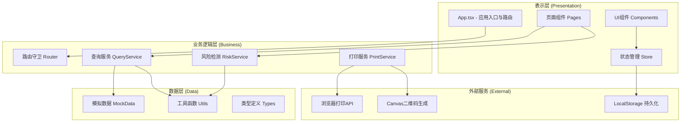

## 1. 架构设计



## 2. 技术说明

- **前端框架**：React 18 + TypeScript + Vite 6
- **样式方案**：Tailwind CSS 3 + 自定义CSS变量主题系统
- **状态管理**：Zustand（轻量级、易调试）
- **路由方案**：React Router DOM 6（Hash路由，纯前端部署友好）
- **图标库**：Lucide React（医疗场景线性图标）
- **后端服务**：无（纯前端，所有数据本地Mock模拟）
- **数据持久化**：LocalStorage（查询历史、反馈记录）
- **二维码生成**：qrcode.react（查询凭证二维码）
- **打印方案**：window.print() + @media print CSS适配

## 3. 路由定义

| 路由路径 | 页面名称 | 用途说明 |
|----------|----------|----------|
| `/` | 扫码首页 | 系统入口、扫码引导、快捷导航 |
| `/manual` | 手动查询 | 追溯码输入、历史记录、格式校验 |
| `/drug/:code` | 药品档案详情 | 基本信息、生产信息、质量检验、状态标识 |
| `/drug/:code/timeline` | 流向时间轴 | 流通节点、时间轴、节点详情、批次对比 |
| `/drug/:code/risk` | 风险核验 | 风险仪表盘、异常告警、真伪验证 |
| `/drug/:code/guide` | 用药提示 | 适应症、用法、禁忌、注意事项 |
| `/feedback` | 反馈记录 | 反馈提交、历史记录、FAQ |
| `/pharmacist` | 药师协助 | 药师信息、呼叫界面、留言功能 |
| `/print/:code` | 查询凭证打印 | 凭证预览、浏览器打印 |
| `/privacy` | 隐私说明 | 数据政策、用户权利说明 |

## 4. 数据模型

### 4.1 核心数据类型定义

```typescript
// 药品追溯码信息
interface DrugTraceInfo {
  traceCode: string;           // 20位追溯码
  productName: string;         // 药品通用名
  brandName: string;           // 商品名
  specification: string;       // 规格
  batchNumber: string;         // 批号
  productionDate: string;      // 生产日期 YYYY-MM-DD
  expiryDate: string;          // 有效期至 YYYY-MM-DD
  manufacturer: string;        // 生产企业
  manufacturerLicense: string; // 生产许可证号
  approvalNumber: string;      // 批准文号
  gmpCertificate: string;      // GMP证书号
  inspectionReportNo: string;  // 检验报告书编号
  inspectionConclusion: '合格' | '不合格' | '待复检';
  inspectionDate: string;      // 检验日期
  drugImage: string;           // 药品图片URL
  dosageForm: string;          // 剂型
  ingredients: string;         // 成份
}

// 流通节点
interface FlowNode {
  id: string;
  nodeType: 'production' | 'inspection' | 'warehouse' | 'wholesale' | 'transport' | 'retail';
  nodeName: string;            // 节点名称
  operator: string;            // 操作人/企业
  location: string;            // 地点
  timestamp: string;           // 操作时间
  temperature?: number;        // 运输温度
  humidity?: number;           // 湿度
  receiver?: string;           // 签收人
  transportNo?: string;        // 运输单号
  description: string;         // 操作描述
  status: 'completed' | 'in_progress' | 'pending';
}

// 风险检测结果
interface RiskResult {
  level: 'safe' | 'warning' | 'danger';
  isExpired: boolean;          // 是否过期
  isRecalled: boolean;         // 是否召回
  recallInfo?: RecallInfo;     // 召回详情
  duplicateQuery: boolean;     // 是否重复查询
  queryCount: number;          // 查询次数
  firstQueryTime: string;      // 首次查询时间
  isAuthentic: boolean;        // 是否为正品
  authenticitySource: string;  // 验证来源
}

// 召回信息
interface RecallInfo {
  recallLevel: '一级' | '二级' | '三级';
  recallReason: string;
  recallDate: string;
  recallScope: string;
  contactPhone: string;
}

// 用药指导
interface MedicationGuide {
  indications: string;         // 适应症
  usageDosage: string;         // 用法用量
  contraindications: string[]; // 禁忌
  adverseReactions: string[];  // 不良反应
  precautions: Precaution[];   // 注意事项
  interactions: string[];      // 药物相互作用
  storage: string;             // 贮藏方法
}

interface Precaution {
  group: string;               // 人群：孕妇/哺乳期/儿童/老人/肝肾功能不全
  content: string;
  severity: 'normal' | 'warning' | 'danger';
}

// 反馈记录
interface FeedbackRecord {
  id: string;
  traceCode: string;
  productName: string;
  category: 'quality' | 'safety' | 'service' | 'other';
  categoryLabel: string;
  content: string;
  contact: string;
  createTime: string;
  status: 'submitted' | 'processing' | 'resolved';
  statusLabel: string;
  reply?: string;
}

// 查询历史
interface QueryHistory {
  traceCode: string;
  productName: string;
  queryTime: string;
}

// 药师信息
interface PharmacistInfo {
  id: string;
  name: string;
  avatar: string;
  licenseNo: string;           // 执业药师证号
  specialty: string;           // 专业领域
  rating: number;              // 评分
  experienceYears: number;     // 从业年限
  isOnline: boolean;           // 是否在线
  serviceHours: string;        // 服务时间
}

// 同批次药品对比
interface BatchCompareItem {
  traceCode: string;
  queryLocation: string;
  queryTime: string;
  isExpired: boolean;
  isRecalled: boolean;
}
```

### 4.2 模拟数据策略

- 预置5种常见药品（布洛芬缓释胶囊、阿莫西林胶囊、复方板蓝根颗粒、硝苯地平控释片、连花清瘟胶囊）的完整数据
- 每个药品生成5条不同追溯码的模拟实例，涵盖：正常、过期、召回、重复查询等多种状态
- 流通节点按真实链路生成：生产→质检→入库→区域批发→冷链运输→药店零售
- 支持追溯码规则：81开头 + 6位企业码 + 6位商品码 + 6位序列号 + 校验位

## 5. 状态管理设计

### Zustand Store 划分

1. **queryStore**：追溯码输入、查询状态、当前药品数据、加载状态
2. **historyStore**：查询历史记录、增删改查、LocalStorage持久化
3. **feedbackStore**：反馈表单数据、历史反馈列表
4. **uiStore**：全局UI状态：侧边栏开合、弹窗、加载遮罩、主题切换

## 6. 项目目录结构

```
src/
├── assets/              # 静态资源：图片、字体
├── components/          # 可复用UI组件
│   ├── layout/         # 布局组件：Header、Footer、Sidebar
│   ├── drug/           # 药品相关：DrugInfoCard、StatusBadge、DrugImage
│   ├── timeline/       # 流向相关：Timeline、TimelineNode、NodeDetail
│   ├── risk/           # 风险相关：RiskGauge、AlertBanner、WarningCard
│   ├── form/           # 表单相关：TraceCodeInput、FeedbackForm、FaqItem
│   ├── pharmacist/     # 药师相关：PharmacistCard、CallInterface
│   └── common/         # 通用：Button、Modal、Spinner、EmptyState
├── pages/              # 页面组件
│   ├── HomePage.tsx
│   ├── ManualPage.tsx
│   ├── DrugPage.tsx
│   ├── TimelinePage.tsx
│   ├── RiskPage.tsx
│   ├── GuidePage.tsx
│   ├── FeedbackPage.tsx
│   ├── PharmacistPage.tsx
│   ├── PrintPage.tsx
│   └── PrivacyPage.tsx
├── store/              # Zustand状态管理
│   ├── queryStore.ts
│   ├── historyStore.ts
│   ├── feedbackStore.ts
│   └── uiStore.ts
├── mock/               # 模拟数据
│   ├── drugs.ts
│   ├── flowNodes.ts
│   ├── risks.ts
│   ├── guides.ts
│   └── pharmacists.ts
├── types/              # TypeScript类型定义
│   └── index.ts
├── utils/              # 工具函数
│   ├── traceCode.ts    # 追溯码校验
│   ├── risk.ts         # 风险检测算法
│   ├── date.ts         # 日期处理
│   └── storage.ts      # 本地存储封装
├── hooks/              # 自定义Hooks
│   ├── useTraceCode.ts
│   ├── useRiskCheck.ts
│   └── usePrint.ts
├── styles/             # 全局样式
│   └── index.css
├── router/             # 路由配置
│   └── index.tsx
├── App.tsx
└── main.tsx
```

## 7. 关键业务逻辑说明

### 7.1 追溯码校验算法
- 长度校验：必须20位数字
- 前缀校验：81开头（国家药品编码标准）
- 校验位：最后1位通过前19位加权计算验证

### 7.2 过期检测
- 基于当前系统日期与 `expiryDate` 对比
- 提前30天进入"临期预警"（橙色）
- 超过有效期判定"过期"（红色）

### 7.3 重复查询检测
- 基于LocalStorage中查询历史记录匹配追溯码
- 首次查询：提示"首次查询，放心使用"
- 多次查询：显示查询次数与首次查询时间，警惕"追溯码被多次查询可能有问题"

### 7.4 风险等级判定逻辑
```
if 召回 → danger(红色)
elif 过期 → danger(红色)
elif 临期 < 30天 → warning(橙色)
elif 重复查询 > 3次 → warning(橙色)
else → safe(绿色)
```

### 7.5 打印功能
- 使用 `@media print` 媒体查询隐藏导航和交互元素
- A4纸张尺寸适配（210mm × 297mm）
- 查询凭证包含：药品信息、追溯码二维码、查询时间、查询IP（模拟）、电子章

## 8. 触屏优化策略

- 所有可交互元素最小触控区域：56px × 56px
- 全局字号放大基准：18px（标准16px基础上+2px）
- 滚动条加粗：宽度16px，便于拖动
- 禁用双击缩放：`<meta viewport user-scalable=no>`
- 增加触觉反馈支持（如浏览器支持 vibration API）
